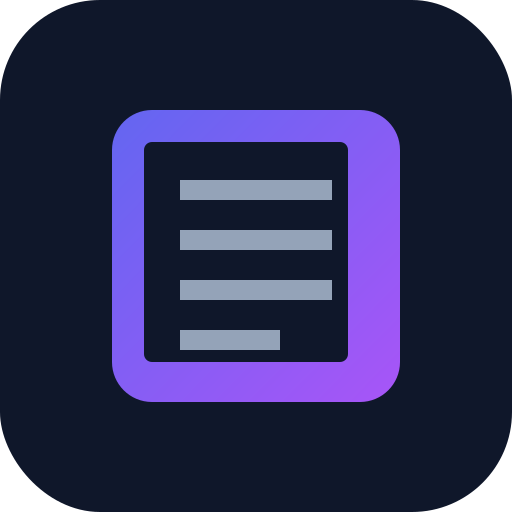

# 📚 LIBRISMUNDIS
> Tu gestor de biblioteca personal, ahora más poderoso, social e inteligente que nunca.

**LibrisMundis** es una aplicación web moderna diseñada para lectores apasionados que desean llevar un registro detallado de sus lecturas, gestionar su vocabulario y coleccionar sus citas favoritas.

## ✨ Características Principales

### 📖 Gestión de Biblioteca Avanzada
*   **Registro Completo**: Añade libros con título, autor, género, idioma, número de páginas y portada.
*   **Seguimiento de Progreso**: Visualiza tu avance en cada libro (páginas leídas / total).
*   **Calificación y Reseñas**: Puntúa tus lecturas con estrellas y guarda tus opiniones personales.
*   **Filtrado y Búsqueda**: Encuentra tus libros instantáneamente por título, autor o categoría.

### 💬 ¡NUEVO! Gestor de Citas & Frases
Hemos renovado completamente la sección de citas para que atesores tus mejores lecturas:
*   **Campos Detallados**: Separación clara de **Libro** y **Autor**.
*   **Numeración Automática**: Tus citas ordenadas y enumeradas (#1, #2...).
*   **Interacción Robusta**: Edita, borra y visualiza tus citas con un solo clic.

### 🎮 ¡NUEVO! Sistema de Gamificación
Haz que la lectura sea un juego y mantén la motivación alta:
*   **Sistema de Niveles**: Gana experiencia (XP) por cada libro leído, palabra aprendida o cita guardada.
*   **Rachas (Streaks)**: Mantén tu racha de lectura diaria.
*   **Estadísticas en Tiempo Real**: Visualiza tu nivel y progreso en la barra superior.

### 🧠 Vocabulario y Aprendizaje
*   **Diccionario Personal**: Guarda palabras nuevas con su definición y contexto.
*   **Filtros de Idioma**: Organiza tu vocabulario para tus estudios de idiomas.

### 🔐 Seguridad y Datos
*   **Autenticación**: Crea tu perfil de usuario para guardar tus datos.
*   **Privacidad Local**: Opción de uso local con localStorage.
*   **Importación/Exportación**: Respalda tus datos o impórtalos desde Goodreads.

## 🚀 Tecnologías
Construido con tecnologías web estándar para máxima compatibilidad:
*   **HTML5 & CSS3** (Variables CSS, Flexbox, Grid, Animaciones)
*   **JavaScript Moderno** (ES6+)
*   **PWA Ready**: Preparado para funcionar como aplicación instalable off-line.

## 🛠️ Instalación y Uso

1.  Clona o descarga este repositorio.
2.  Abre el archivo `index.html` en tu navegador favorito.
3.  ¡Empieza a añadir libros!

## 📝 Notas de la Versión Actual
*   **v2.1**: Refactorización completa del sistema de Citas (Split Book/Author), corrección de modales, numeración automática y mejoras visuales.
*   **v2.0**: Implementación del sistema de Gamificación, niveles y rediseño de UI.

## 📄 Licencia
Este proyecto es de uso libre para fines personales y educativos.

